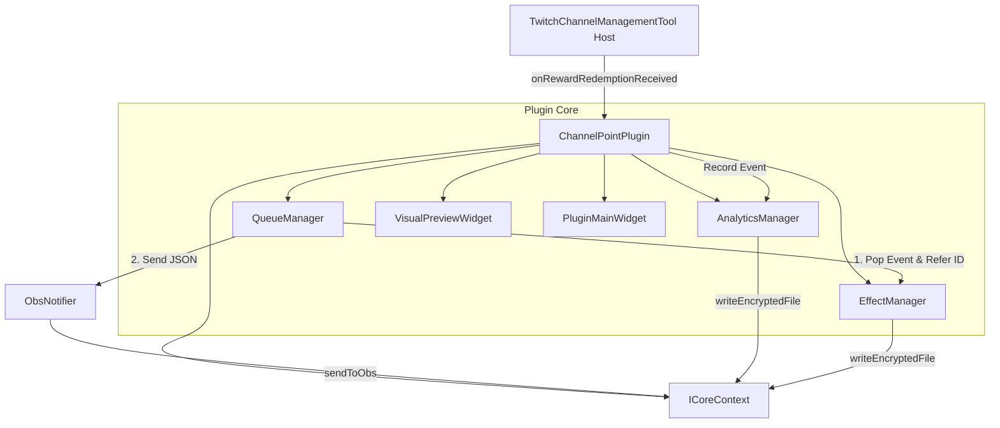

# 基本設計書 (外部設計・アーキテクチャ設計) - ChannelPointPlugin

## 1. システムアーキテクチャおよびプラグインインターフェース概要

本プラグインは `IChannelPlugin` インターフェースを実装する C++ / Qt6 モジュールです。

- **プラグインアイコン**: `pic/ChannelPoint.png` のバイナリデータを `iconPngData()` 経由でホストアプリの左サイドバータブへ提供します。
- **機能切り替えサブタブ**: プラグイン内部のメイン画面は、画面上部/下部に機能切り替えサブタブ（`ダッシュボード`, `報酬演出管理`, `統計ランキング`, `システム設定`）を配置します。



---

## 2. モジュール・クラス構成設計

| クラス名 | 役割・責務 |
| :--- | :--- |
| **`ChannelPointPlugin`** | プラグインエントリーポイント。`IChannelPlugin` インターフェース実装 (`iconPngData` で `pic/ChannelPoint.png` 返却)。 |
| **`EffectManager`** | 報酬ごとの演出設定・演出効果（画像/音声/動画/複合、サイズ、座標、テキスト）の保持および `effect_settings.json` の管理。 |
| **`VisualPreviewWidget`** | OBSキャンバス解像度（例: 1920x1080）に対する演出の表示位置・サイズを2D領域上で視覚的に調整し、はみ出し（Boundary Check）を判定・補正するプレビューウィジェット。 |
| **`QueueManager`** | ID参照型Queue制御。順次再生タイマー、最大キュー上限管理、および控えめで確実な「緊急停止」処理。 |
| **`AnalyticsManager`** | 配信セッションの自動判定（タイムスタンプギャップ検出）、報酬別/リスナー別統計の集計・データ構造化および暗号化ファイル永続化。 |
| **`ObsNotifier`** | OBSブラウザソース向けJSONフォーマット構築および `ICoreContext::sendToObs` の呼び出し。 |

---

## 3. 画面レイアウト・UI設計 (Wireframes)

プラグイン内部の画面は、上部サブタブ (`ダッシュボード`, `報酬演出管理`, `統計ランキング`, `システム設定`) とメイン操作エリアで構成されます。

```
+---------------------------------------------------------------------------------------------------+
| [🏠 ダッシュボード]  [🎁 報酬演出管理]  [📊 統計ランキング]  [⚙ システム設定]    | [🛑 緊急停止] |
+---------------------------------------------------------------------------------------------------+
|                                                                                                   |
| < 選択中のサブタブ画面エリア >                                                                    |
|                                                                                                   |
+---------------------------------------------------------------------------------------------------+
```

---

### 各サブタブの画面仕様

#### 1. 🎁 報酬演出管理タブ (Reward Effect Manager)
左パネルに「登録済みの報酬一覧」、右パネルに「選択中報酬の詳細設定フォーム」を配置します。

```
+---------------------------------------------+-----------------------------------------------------+
| 登録済みの報酬一覧:                         | 報酬情報の設定                                      |
|                                             | 報酬 ID (Twitch): [ 054c098f-e9a6-4a1d-...       ]  |
| ● [設定済] No Japanease English (300pt)     | 報酬名 (表示用):  [ No Japanease English         ]  |
| ● [設定済] 昔あった怖かった話 (800pt)       | 消費ポイント数:   [ 300 ] pt                        |
| ○ [未設定] VIP!!! (250000pt)                | クールタイム:     [ 0 ] 秒                          |
| ○ [未設定] ストレッチ！ (250pt)             | 演出再生モード:   [ 全ての演出を順番に再生   v ]    |
| ● [設定済] アウト！ (200pt)                 | ステータス:       [■ 報酬演出の有効化            ]  |
| ○ [未設定] 姿勢チェック！ (100pt)           |-----------------------------------------------------|
| ● [設定済] 見てない (10pt)                  | 演出効果（エフェクト）設定                          |
|                                             | 編集対象の演出: [ 演出 1  v ] [ + 演出追加 ] [X削除] |
|                                             | [ ] カスタムHTML演出として実行                      |
|                                             | 演出の種類: [ 画像 + 音声 (image + audio)      v ]  |
|                                             | 画像ファイル: [ C:/assets/no_english.png ] [参照...] |
|                                             | 動画ファイル: [                           ] [参照...] |
|                                             | 効果音ファイル:[ C:/assets/se_alert.mp3    ] [参照...] |
|                                             | 表示・演出時間:   [ 5 ] 秒                          |
|                                             | 表示サイズ (1-100%): [ 60 ] %                        |
|                                             | 吹き出し表示文字列: [ {user}がルールを破った！   ]  |
|                                             | 表示位置: [ カスタム座標 (custom)              v ]  |
|                                             | 中心座標 (px):  X: [ 200 ] px    Y: [ 150 ] px       |
|                                             | [ 視覚的プレビュー & はみ出し調整... ]              |
|                                             |-----------------------------------------------------|
|                                             | [ ▶ 演出をテスト再生 (OBS) ]                         |
| +-----------------------------------------+ | [ 新規演出を登録 ] [ Twitch同期 ] [ 設定保存 ]      |
| | [新規演出を登録]  [Twitch同期]          | |                                                     |
+---------------------------------------------+-----------------------------------------------------+
```

##### 演出の種類 (Media Types)
コンボボックスから以下を選択・複合可能とします：
1. **画像のみ (image)**
2. **音声のみ (audio)**
3. **動画のみ (video)**
4. **画像 + 音声 (image + audio)**
5. **動画 + 音声 (video + audio)**
6. **カスタム (HTML / CSS / JS)**

##### 視覚的プレビュー・はみ出し自動チェック (Visual Layout & Boundary Check)
- OBS基準解像度（デフォルト `1920 x 1080`、システム設定タブにてユーザー変更可能）を基準としたキャンバス mini プレビューを表示。
- 中心座標 (X, Y) や表示サイズ (%) を変える際、プレビュー枠上で直感的にドラッグ＆配置。
- **はみ出し防止 (Boundary Check)**: 画面外へ完全にはみ出す座標が設定された場合、自動的に警告マークを表示し、キャンバス内に収まるよう自動クランピング（自動座標補正）を実行。

---

#### 2. 📊 統計ランキングタブ (Analytics & Ranking Tab)
```
+---------------------------------------------------------------------------------------------------+
| 配信セッション: [ 2026-07-20 15:00 ~ (現在配信中)  v ]  [ CSVエクスポート ]                        |
+-------------------+-------------------+-------------------+---------------------------------------+
| 総利用回数        | 消費ポイント合計  | アクティブリスナー | 一番人気の報酬                        |
|  42 回            |  12,500 pt        |  18 人            | 水を飲む (18回)                       |
+-------------------+-------------------+-------------------+---------------------------------------+
| ■ 報酬別利用集計                                | ■ リスナー別貢献ランキング                      |
| +------------------+------+----------+----------+ | +-----+------------+------+----------+--------+ |
| | 報酬名           | 回数 | 消費pt   | 割合     | | | 順位| ユーザー名 | 回数 | 消費pt   | 割合   | |
| +------------------+------+----------+----------+ | +-----+------------+------+----------+--------+ |
| | 水を飲む         | 18   |  1,800pt | 42.8%    | | |  1  | Alice      |  8   |  4,000pt | 32.0%  | |
| | 画面拡大         | 12   |  6,000pt | 28.5%    | | |  2  | Bob        |  5   |  2,500pt | 20.0%  | |
+---------------------------------------------------------------------------------------------------+
```

---

#### 3. ⚙ システム設定タブ (System Settings Tab)
```
+---------------------------------------------------------------------------------------------------+
| ■ OBSキャンバス & キュー基本設定                                                                 |
| OBS解像度設定:  幅 [ 1920 ] px  ×  高さ [ 1080 ] px  (標準: 1920x1080 / 1280x720)                |
| 最大キュー保持数: [ 20 ] 件                                                                       |
| キュー超過時の動作: [ 古い演出をスキップする (Drop oldest)   v ]                                  |
| セッション自動判定無操作時間: [ 120 ] 分 (指定時間以上イベントがない場合、新配信として分割)      |
+---------------------------------------------------------------------------------------------------+
```

---

## 4. データ構造設計

### 4.1 演出マスター設定 (`effect_settings.json`)
```json
{
  "obs_canvas": { "width": 1920, "height": 1080 },
  "max_queue_size": 20,
  "effects": [
    {
      "reward_id": "054c098f-e9a6-4a1d-b73d-c5d03f22fb1d",
      "reward_name": "No Japanease English",
      "points": 300,
      "cooldown_sec": 0,
      "enabled": true,
      "playback_mode": "sequential",
      "items": [
        {
          "effect_id": "effect_1",
          "media_type": "image_audio",
          "image_path": "C:/assets/no_english.png",
          "video_path": "",
          "audio_path": "C:/assets/se_alert.mp3",
          "duration_sec": 5,
          "size_percent": 60,
          "text_template": "{user}がルールを破った！",
          "position_preset": "custom",
          "center_x": 200,
          "center_y": 150
        }
      ]
    }
  ]
}
```

---

## 5. 変更履歴
- **2026-07-20 (v2.0)**: ユーザーフィードバック・画面参考画像の完全反映。
  - プラグインアイコンに `pic/ChannelPoint.png` を割り当て。
  - 控えめで確実な緊急停止ボタン（右サブヘッダー位置）へ再配置。
  - 演出種別を「画像 / 音声 / 動画 / 複合（画像+音声、動画+音声、カスタム）」に拡張。
  - OBSキャンバス解像度設定および視覚的プレビュー・はみ出し自動チェック（Boundary Check）機能を追加。
  - 参考画像に基づき左リスト（設定済/未設定ステータス）＋右編集フォームの精密UIレイアウトを定義。
