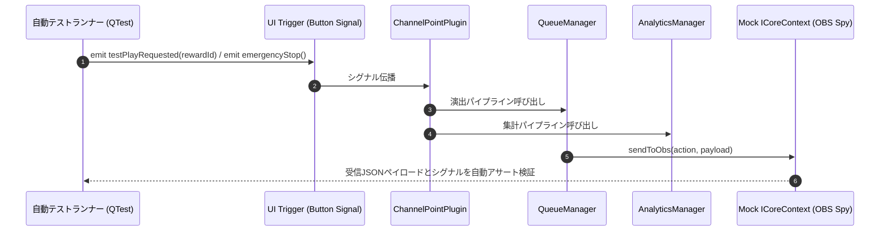

# 結合テスト仕様書 (Integration Test Specification) - ChannelPointPlugin

## 1. 概要
本ドキュメントは、基本設計書 (`doc/02_BasicDesignSpecification.md`) に対応する結合テスト（インテグレーションテスト）の仕様書です。
UI/UXのレイアウト・視覚表示確認は除外され、ボタン押下やイベント受信などの**トリガーシグナル発火後、コンポーネント連携パイプラインが仕様通りに自動実行されること**を検証します。

---

## 2. 自動結合テストパイプライン構成
Qt シグナル・スロットを監視する `QSignalSpy` を活用し、トリガーイベント投入から最終出力（`ICoreContext::sendToObs` 送出ペイロードおよび暗号化ファイル書き込み）までの自動応答をテストします。

---

## 3. 結合テストケース一覧 (Integration Test Cases)

### 3.1 イベント受信からOBS演出送出連携パイプライン
| テストID | シグナル / トリガー | 連携コンポーネント | 自動検証ポイント |
| :--- | :--- | :--- | :--- |
| **IT-PIPE-01** | ホストからの `onRewardRedemptionReceived()` 発火 | Plugin -> Analytics -> Queue -> ObsNotifier | 1. `AnalyticsManager` に集計が記録されること 2. `QueueManager` に演出ID参照付きで積載されること 3. `ObsNotifier` 経由で正しいJSON（`render_effect`）が `ICoreContext::sendToObs` へ引き渡されること |
| **IT-PIPE-02** | UI上の `[▶ 演出をテスト再生]` ボタンシグナル発火 | UI (Signal) -> Queue -> ObsNotifier | キューの最後尾にテスト演出が即座に積載され、OBS向けテスト送出JSONが生成されること |

### 3.2 緊急停止 (Emergency Stop) 割り込みパイプライン
| テストID | シグナル / トリガー | 連携コンポーネント | 自動検証ポイント |
| :--- | :--- | :--- | :--- |
| **IT-EMG-01** | UI上の `[🛑 緊急停止]` ボタンシグナル発火 | UI (Signal) -> QueueManager -> ObsNotifier | 1. 処理待ちキュー（QQueue）が即時にサイズ 0 へ全クリアされること 2. 実行中タイマーが停止すること 3. `sendToObs` に `clear_effect` ペイロードが最優先で送信されること |

### 3.3 設定変更および自動再読み込みパイプライン
| テストID | シグナル / トリガー | 連携コンポーネント | 自動検証ポイント |
| :--- | :--- | :--- | :--- |
| **IT-CFG-01** | UI上の `[設定を保存]` ボタンシグナル発火 | UI (Signal) -> EffectManager -> 暗号化保存 | `effect_settings.json` が最新値で上書き保存され、次回イベント受信時に変更後の演出ID・パラメータが即座に適用されること |

---

## 4. 自動化実行と判定基準
すべての結合テストは、モック `ICoreContext` を接続したテスト環境下で無人実行され、全テストケースの Pass/Fail 結果が自動出力されます。
